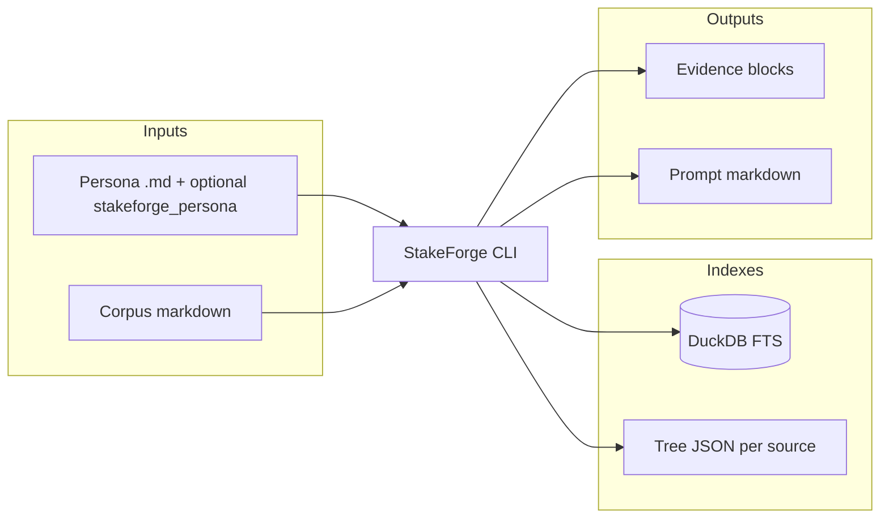
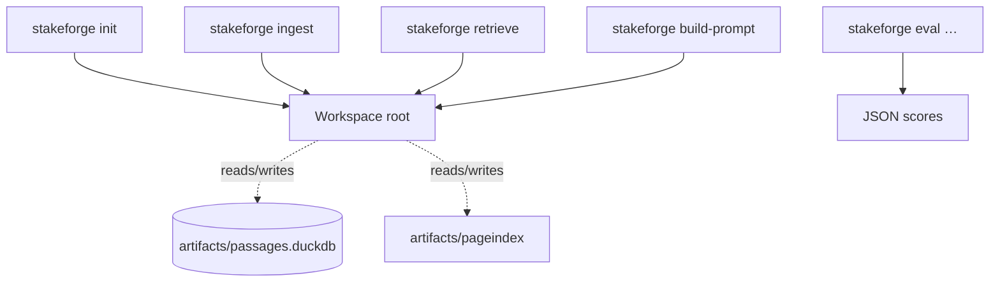
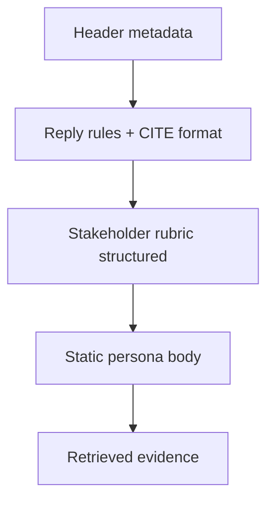
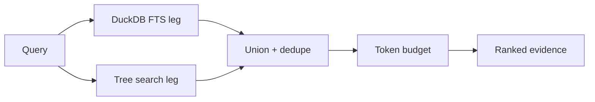
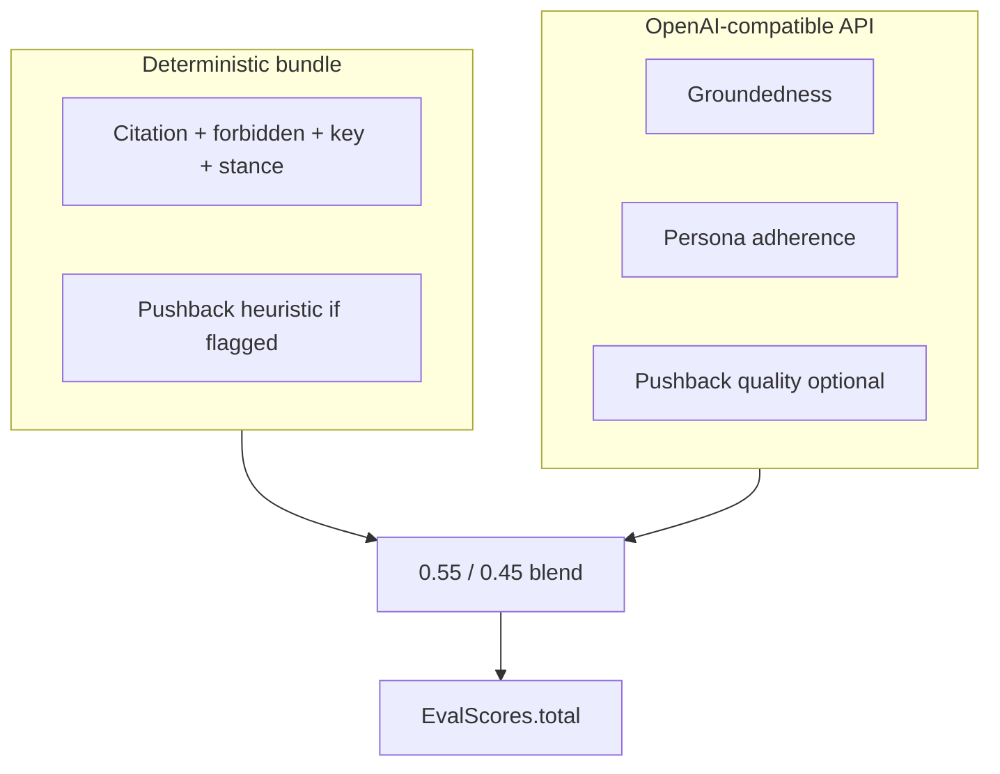
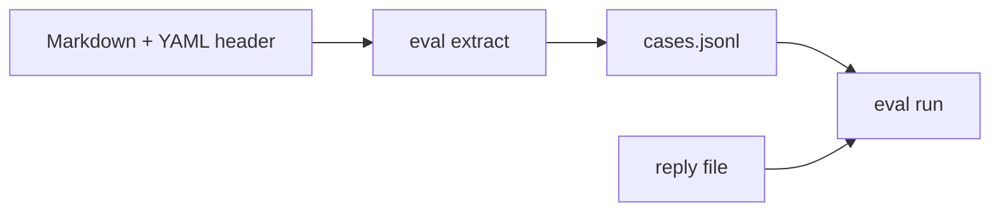

# 00 — Visual summary

One page of diagrams for quick orientation. Narrative detail lives in numbered guides starting at [01 — Overview](01-overview.md).

## 1) The product in one picture



## 2) Commands vs. artifacts

| Command | Typical inputs | Writes / prints |
|---------|----------------|-----------------|
| `stakeforge init` | `--root` | Creates workspace dirs |
| `stakeforge ingest` | `--stakeholder-id`, `--md-path` | `passages.duckdb`, `artifacts/pageindex/…`, optional Dolt commit |
| `stakeforge retrieve` | stakeholder, `--query` | Evidence to stdout (`md` or `json`) |
| `stakeforge build-prompt` | persona path, query | Prompt markdown; `logs/evidence.<id>.json` |
| `stakeforge eval extract|score|run` | JSONL, replies, optional API | Scores JSON |



## 3) Prompt layout (what the model sees)



Details: [10 — Structured persona rubric](10-structured-persona-rubric.md), [04 — Workflow](04-workflow-ingest-to-prompt.md).

## 4) Hybrid retrieval merge



## 5) Deterministic scoring weights (normalized)

Base weights always apply; **pushback** is added only when `expected.must_push_back` is true. The raw weighted sum is divided by the **active weight sum** so `deterministic_total` stays in **[0, 1]**.

| Component | Weight | Notes |
|-----------|--------|--------|
| Citations | **0.40** | Blend of must-cite coverage + validity vs. case evidence ids |
| Forbidden phrases | **0.25** | Substring match on `must_not_claim` (careful with negations) |
| Key phrases | **0.10** | `key_points` presence |
| Stance heuristic | **0.25** | Keyword hints for `stance` |
| Pushback heuristic | **0.20** (optional) | Only if `must_push_back` |

## 6) Optional LLM rubric blend

When `--llm-rubric` is set:

```text
llm_composite = mean( groundedness, persona_adherence [, pushback_quality] )
total         = 0.55 * deterministic_total + 0.45 * llm_composite
```

`pushback_quality` is included in the mean **only** when the model returns a numeric score (typically when the case expects pushback).



## 7) Interview note → eval case



## Next

Continue to [Documentation home](README.md) or jump to [04 — Workflow](04-workflow-ingest-to-prompt.md).
