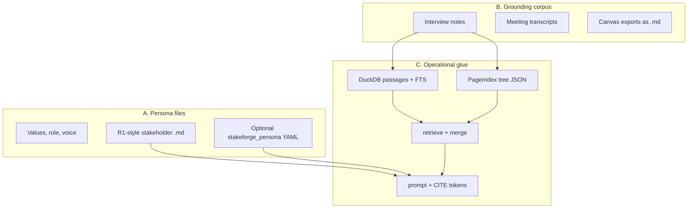

# 01 — Overview

## What StakeForge does

StakeForge helps you **ground stakeholder-facing language models in real materials**: interview notes, transcripts, emails (as Markdown), and structured persona files.

Rather than “a generic chatbot,” you get:

1. **Retrieval** over your corpus with **no vector database** (Release 2 constraint).
2. **Evidence-backed prompts** that carry **citations** your eval harness can check.
3. **Optional versioning** of sources and artifacts via **Dolt** (when installed).
4. **Evaluation**: deterministic checks (citations, forbidden phrases, optional **pushback heuristic**) plus an optional **LLM rubric** for groundedness, persona adherence, and pushback quality when relevant.
5. **Structured persona rubric**: optional YAML block `stakeforge_persona:` in the persona Markdown file is rendered into prompts and fed to the LLM judge when you use `--llm-rubric` (see [10 — Structured persona rubric](10-structured-persona-rubric.md)).

## Implementation stack (this repo)

| Piece | Role |
|--------|------|
| Python **3.11+** | CLI + library |
| **Pydantic v2** `BaseModel` (`frozen=True`) | Config, evidence, eval cases, persona schema |
| **DuckDB** | Passage table + FTS (`PRAGMA create_fts_index`, BM25 scoring) |
| **PyYAML** | Persona + interview front matter |

## Who it is for

- Product leaders, PMs, and program managers running **stakeholder alignment** work.
- Teams that already keep **Markdown** corpora (or can convert to Markdown with headings).
- People who want **repeatable** prompts and **measurable** reply quality.

## Release map (how this repo is organized)

| Release | In this repository |
|---------|---------------------|
| **R1** | Personas as Markdown prose (“static persona” section in prompts). |
| **R2 (implemented here)** | `ingest` → DuckDB FTS + tree JSON; `retrieve` hybrid merge; `build-prompt` with **rubric + citations**; `eval` JSONL + deterministic + optional LLM rubric; optional **Dolt** commits. |
| **R3 (directional)** | Deeper “judge” workflows, tighter product packaging—out of scope for the core CLI here. |

This codebase targets **v0.2.x** behavior described in `pyproject.toml` and `spec/release-2-pageindex-duckdb-rag.md`.

## Non-goals (in this release)

- No embedding store, Chroma, pgvector, or similar.
- No hosted web UI (you can paste prompts into any chat client).
- No automatic “alignment score” judge (that is Release 3 territory).

## Mental model

Think in three layers:

When you run `build-prompt`, StakeForge combines **A** and **evidence from B** (via **C**) into a single markdown prompt for your LLM.

## Next document

[02 — Architecture](02-architecture.md)
