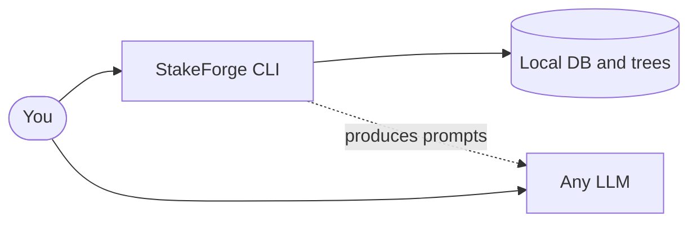
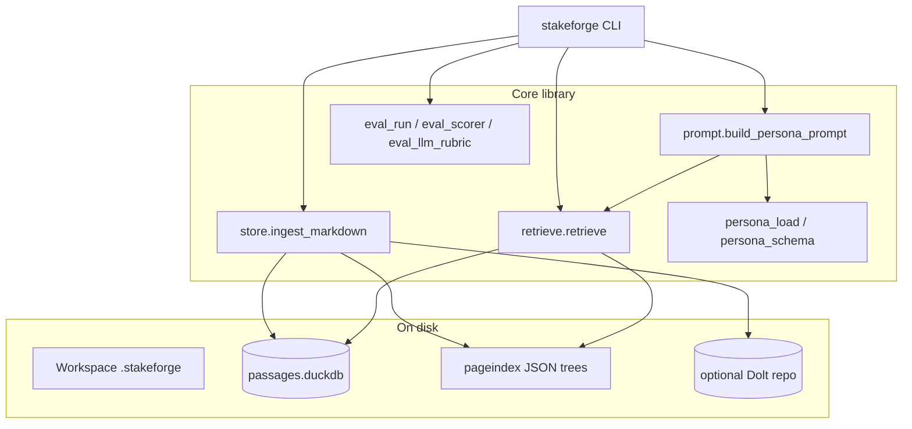
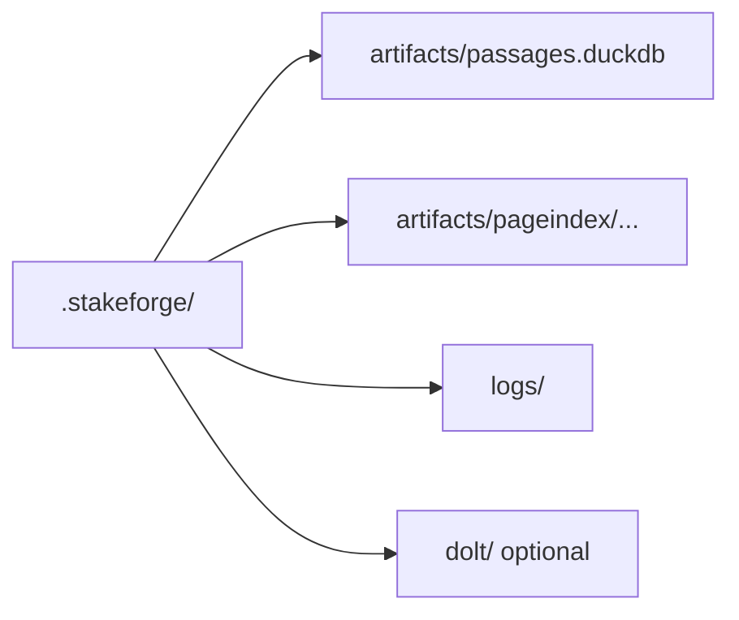
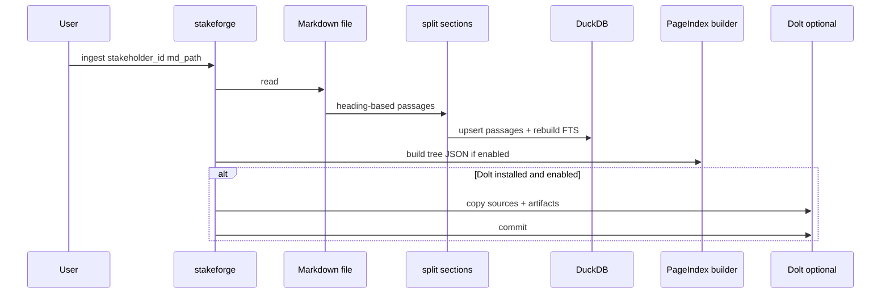
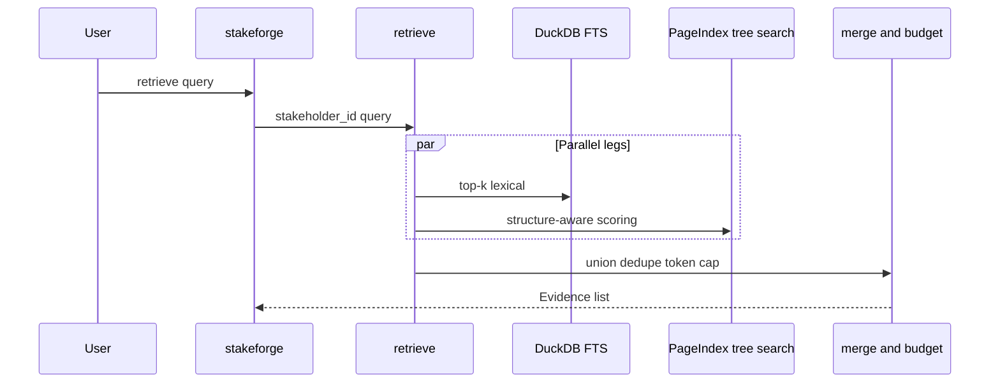
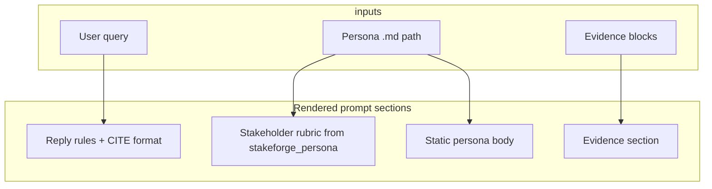
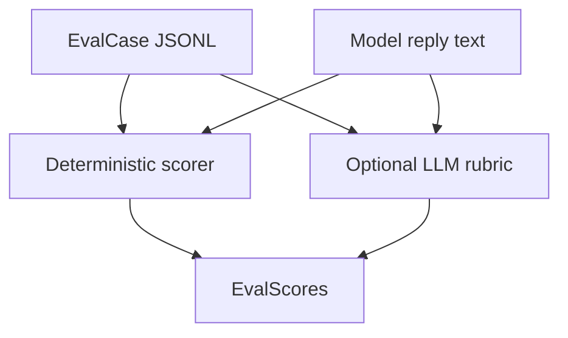
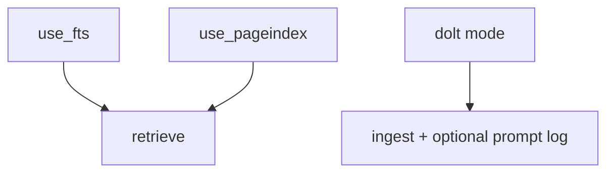

# 02 — Architecture

## High-level system

StakeForge is primarily a **local tool**. The LLM is outside the core; you bring your own model and API.

## Component diagram

## Workspace layout

Default root: `.stakeforge/` (or `STAKEFORGE_ROOT`).

| Path | Purpose |
|------|---------|
| `artifacts/passages.duckdb` | Passage rows + FTS index |
| `artifacts/pageindex/<stakeholder>/` | Tree JSON per ingested Markdown stem |
| `logs/` | `evidence.<prompt_id>.json` snapshots for each `build-prompt` |
| `dolt/` | Optional SQL-versioned copies of sources + artifacts |

## Ingest sequence

What happens when you run `stakeforge ingest`:

## Retrieve sequence

## Prompt assembly

The prompt instructs the model to cite evidence as `CITE[<evidence_id>]` (see `Evidence.format_markdown()`), which powers automated evaluation.

## Evaluation pipeline

When `--llm-rubric` is enabled, totals blend deterministic and rubric scores (see [06 — Evaluation](06-evaluation-and-rubric.md)).

## Configuration flags

Global CLI flags (also env-backed):

| Flag / env | Default | Effect |
|------------|---------|--------|
| `--use-fts` / `STAKEFORGE_USE_FTS` | `1` | DuckDB FTS leg in `retrieve` |
| `--use-pageindex` / `STAKEFORGE_USE_PAGEINDEX` | `1` | Tree-json leg in `retrieve` |
| `--token-budget` / `STAKEFORGE_TOKEN_BUDGET` | `1200` | Approx total evidence tokens |
| `--max-tokens-per-source` / `STAKEFORGE_MAX_TOKENS_PER_SOURCE` | `400` | Cap per `source_uri` |
| `--dolt` / `STAKEFORGE_DOLT` | `auto` | `auto` / `on` / `off` for versioned commits |

Turning off a leg is a **flag**, not a fork.

## Next document

[03 — Installation](03-installation.md)
