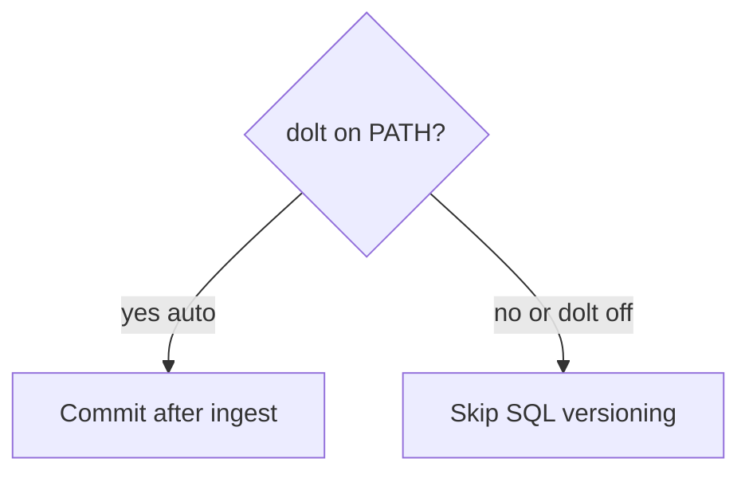

# 03 — Installation

## Requirements

- Python 3.11+ (3.12+ recommended).
- `pip` and a virtual environment (PEP 668 environments need a venv).

## Minimal install

```bash
cd StakeForge
python -m venv .venv
source .venv/bin/activate   # Windows: .venv\Scripts\activate
pip install -e .
stakeforge --help
```

## Optional: PageIndex upstream integration

The ingestion step can call the **PageIndex** library when installed; otherwise StakeForge uses a **deterministic Markdown tree fallback**.

```mermaid
flowchart LR
  subgraph default [Default]
    FB[Built-in heading tree]
  end
  subgraph opt [Optional pip extra]
    PI[pageindex from GitHub]
  end
  ING[ingest] --> FB
  ING --> PI
```

Install (example):

```bash
pip install -e ".[pageindex]"
```

You may need API credentials for PageIndex features that summarize nodes with an LLM. The StakeForge ingest path prefers structure + node text without requiring summaries when using the fallback.

## Optional: Dolt

If `dolt` is on your `PATH`, StakeForge can commit **sources**, **DuckDB snapshots**, and **PageIndex JSON** into a local Dolt repository under `.stakeforge/dolt/`.



Force behavior:

- `--dolt on` — require Dolt (fails if missing).
- `--dolt off` — never use Dolt.
- `--dolt auto` — default; detect `dolt version`.

## Environment variables (common)

| Variable | Purpose |
|----------|---------|
| `STAKEFORGE_ROOT` | Default `--root` for workspace |
| `STAKEFORGE_USE_FTS` | `1` / `0` — DuckDB FTS leg |
| `STAKEFORGE_USE_PAGEINDEX` | `1` / `0` — tree-json leg |
| `STAKEFORGE_TOKEN_BUDGET` | Total evidence token budget (approx) |
| `STAKEFORGE_MAX_TOKENS_PER_SOURCE` | Per-source evidence cap (approx) |
| `STAKEFORGE_DOLT` | `auto` / `on` / `off` (mirrors `--dolt` where applicable) |
| `OPENAI_API_KEY` | Default key for `--llm-rubric` |
| `OPENAI_BASE_URL` | Optional API base URL for OpenAI-compatible endpoints |
| `STAKEFORGE_RUBRIC_MODEL` | Default judge model id when using `--llm-rubric` |

## Container verification (Podman + Task)

To run all **quick verification** checks inside an OCI image:

```bash
task verify
```

See [09 — Podman + Taskfile](09-podman-taskfile.md).

## Next document

[04 — Workflow: ingest → prompt](04-workflow-ingest-to-prompt.md)
