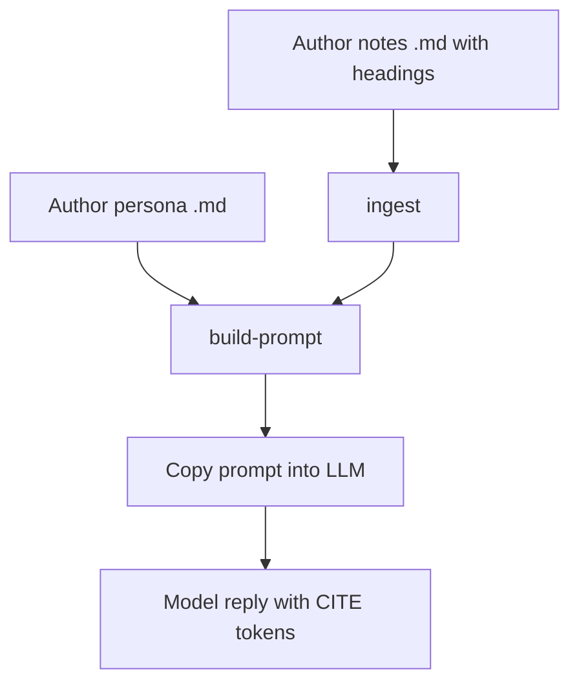
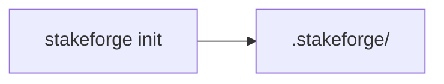
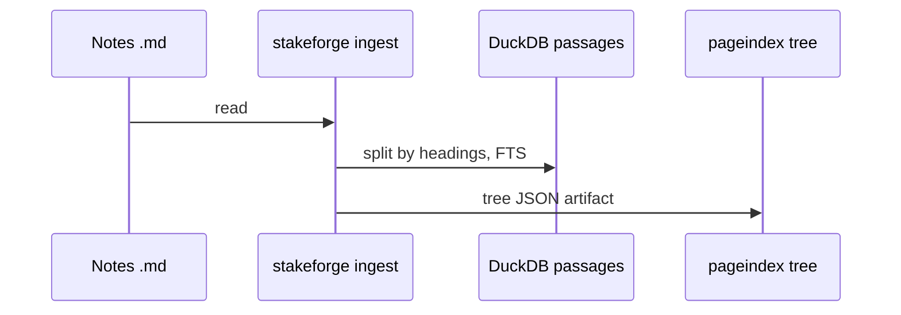
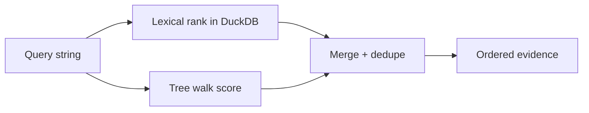
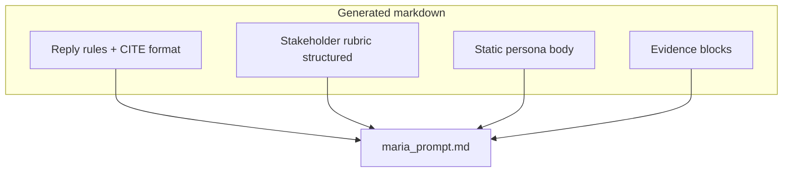
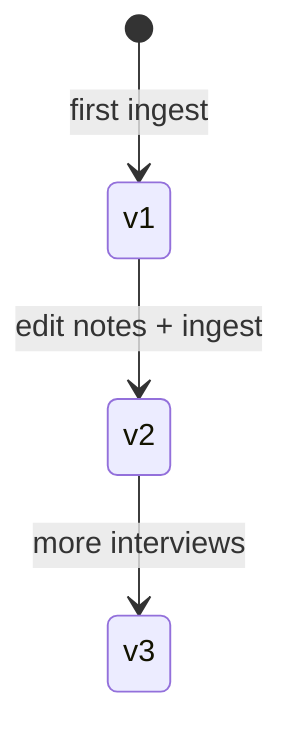

# 04 — Workflow: ingest → prompt

This guide is the **happy path** most teams will run weekly.

## Prerequisites

- Installed `stakeforge` (see [03 — Installation](03-installation.md)) or run via **Podman** (see [09 — Podman + Taskfile](09-podman-taskfile.md)).
- Two kinds of Markdown:
  - **Persona file** — narrative body plus **optional** YAML block `stakeforge_persona:` for a structured rubric ([10 — Structured persona rubric](10-structured-persona-rubric.md)).
  - **Corpus file** (notes, transcript, emails) with `#` headings so sections split cleanly.

## End-to-end flow



## Step 1 — Initialize workspace

```bash
stakeforge init
```

Creates `.stakeforge/` (unless you pass `--root`).



## Step 2 — Ingest corpus Markdown

Example (paths from repo root, using `examples/`):

```bash
stakeforge ingest \
  --stakeholder-id maria_chen \
  --md-path examples/conversations/2026-03-kickoff-maria.md
```

What you are telling StakeForge:

- **stakeholder_id** — namespaces passages and trees.
- **md_path** — the document to index.



### Heading tip

Passages are cut on headings like:

```markdown
## Timeline concerns
Body text here becomes one passage bucket.
```

If a file has **no headings**, StakeForge stores it as **one passage**.

## Step 3 — Retrieve smoke test

```bash
stakeforge retrieve \
  --stakeholder-id maria_chen \
  --query "ROI timeline board" \
  --format md
```

You should see block quotes with **Evidence ID** and **CITE[...]** hints.



## Step 4 — Build the LLM prompt

```bash
stakeforge build-prompt \
  --stakeholder-id maria_chen \
  --persona-md examples/stakeholders/maria_chen.md \
  --query "Can we promise ROI in two quarters?" \
  --out /tmp/maria_prompt.md
```

Open `/tmp/maria_prompt.md` in your editor and paste into ChatGPT, Claude, or your internal gateway.



On disk, `build-prompt` also writes `logs/evidence.<prompt_id>.json` under your workspace root (stable hash from stakeholder, persona path, query, and evidence).

### Global CLI flags (repeat on any subcommand)

| Flag | Env | Purpose |
|------|-----|--------|
| `--root` | `STAKEFORGE_ROOT` | Workspace root (default `.stakeforge`) |
| `--use-fts` | `STAKEFORGE_USE_FTS` | `1` / `0` |
| `--use-pageindex` | `STAKEFORGE_USE_PAGEINDEX` | `1` / `0` |
| `--token-budget` | `STAKEFORGE_TOKEN_BUDGET` | Total evidence budget |
| `--max-tokens-per-source` | `STAKEFORGE_MAX_TOKENS_PER_SOURCE` | Per-source cap |
| `--dolt` | `STAKEFORGE_DOLT` | `auto` / `on` / `off` |

### Why `CITE[...]` matters

Your model answer should include tokens such as:

```text
CITE[fts:0f1a2b3c4d5e6f708090]
```

Those strings are what the **eval harness** checks (see [06 — Evaluation](06-evaluation-and-rubric.md)).

## Step 5 — (Optional) Re-ingest after edits

When notes change, ingest again. If Dolt is enabled, you get a new commit with updated artifacts.



## Troubleshooting

| Symptom | Likely cause |
|---------|----------------|
| Empty retrieval | Wrong `stakeholder_id` or not ingested yet |
| Only one huge passage | Missing `#` / `##` headings in notes |
| PageIndex errors | Install extra or rely on fallback tree |
| Dolt errors | Pass `--dolt off` or install Dolt |

## Eval quick path (optional)

| Step | Command |
|------|---------|
| Build JSONL from interview | `stakeforge eval extract --notes path/to/notes.md --out cases.jsonl` |
| Score one reply | `stakeforge eval score --case case.json --reply-file reply.txt --persona-base .` |
| Suite | `stakeforge eval run --dataset cases.jsonl --replies-dir replies/ --persona-base .` |

Replies must be named `<case_id>.txt` or `<case_id>.md`. See [06 — Evaluation](06-evaluation-and-rubric.md).

## Next document

[05 — Hybrid retrieval](05-hybrid-retrieval.md)
