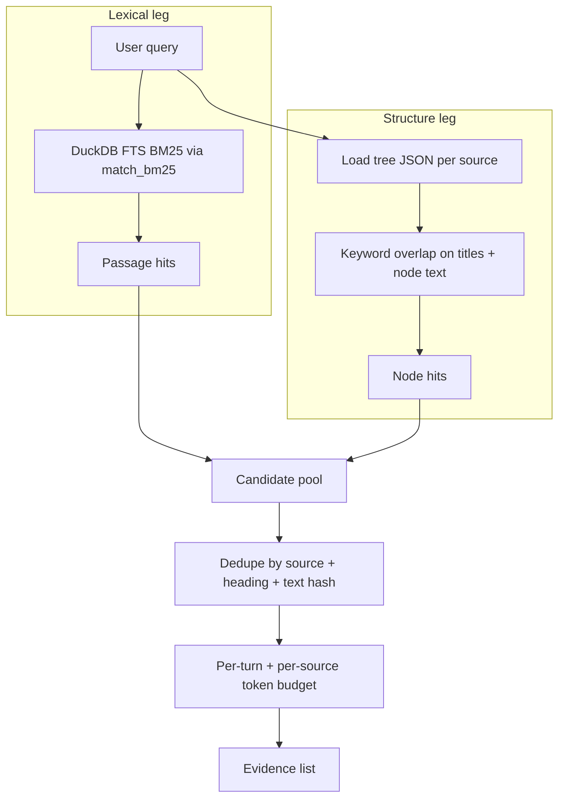
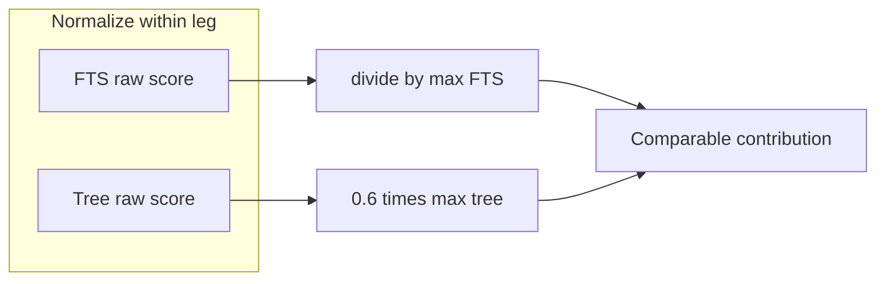
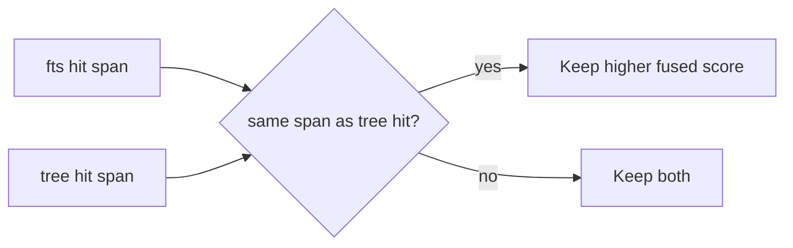
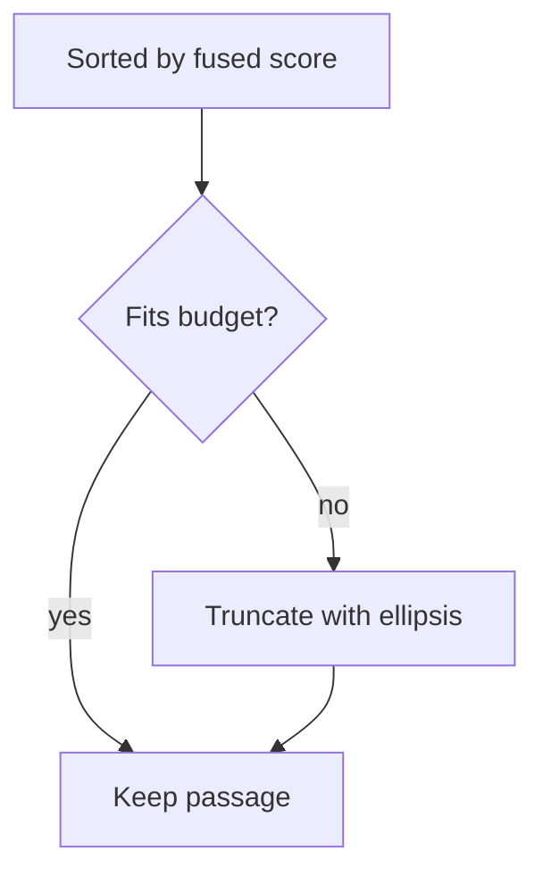
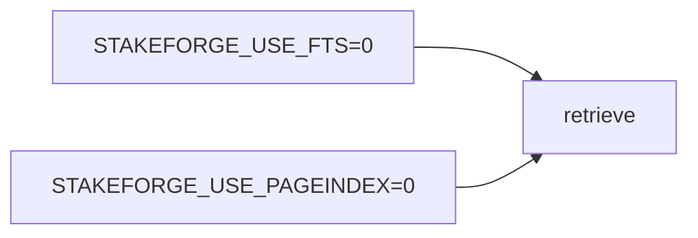

# 05 — Hybrid retrieval

Release 2 requires **two complementary recall mechanisms** and a **merge policy**. StakeForge implements:

1. **DuckDB full-text search (FTS)** — excellent for names, dates, acronyms, exact phrases.
2. **PageIndex-style tree navigation** — structure-first recall over Markdown headings (vectorless).
3. **Merge** — union candidates, dedupe spans, normalize scores, apply **token budgets**.

## Conceptual picture

## Score fusion (intuition)

- **FTS** contributes up to **`1.0`** after max-normalization.
- **PageIndex leg** contributes up to **`0.6`** after max-normalization so headings guide, but strong lexical hits still surface.

Exact numbers live in `src/stakeforge/retrieve.py`; the diagram expresses intent.

## Dedupe

Candidates that share the same **source**, **heading path**, and **text hash** collapse to one entry so you do not double-count the same span from both legs.

## Token budgeting

Two knobs matter:

- **`token_budget`** — cap total evidence size for the prompt (approximate tokens).
- **`max_tokens_per_source`** — prevent one long doc from eating the whole budget.

## Turning legs off

Use this for debugging (“is FTS hurting?”) without maintaining two code paths.

## Next document

[06 — Evaluation and rubric](06-evaluation-and-rubric.md)
