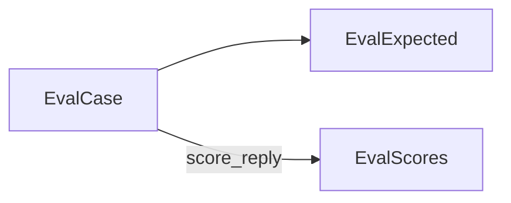
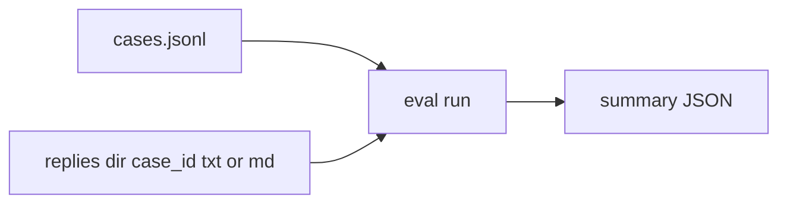
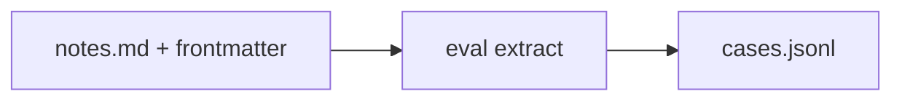
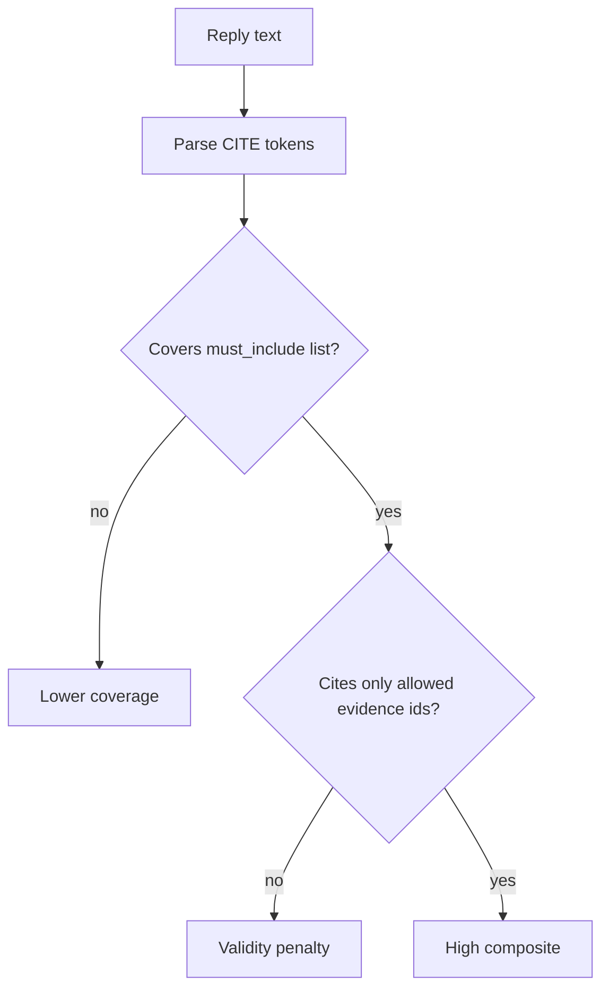
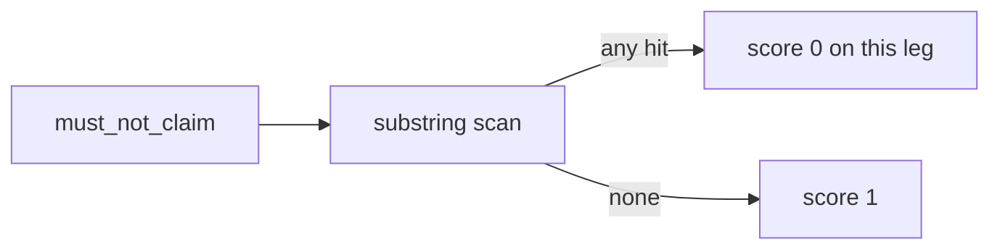
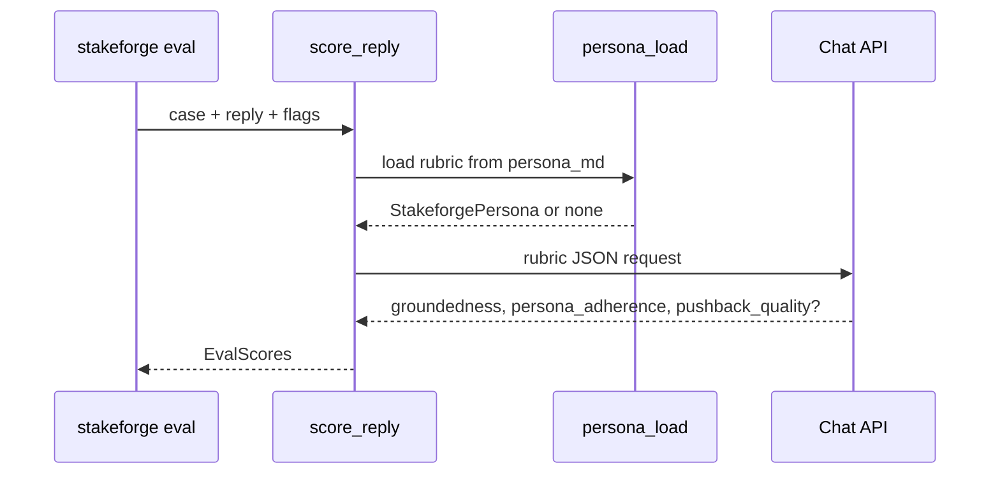
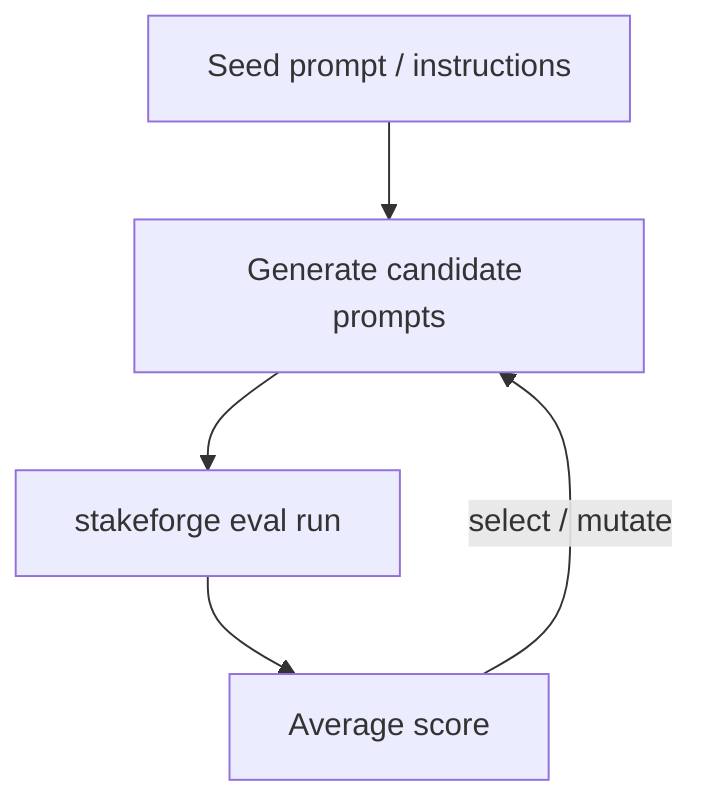

# 06 — Evaluation and rubric

StakeForge ships a **small but rigorous** evaluation loop for:

- Regression-testing persona replies.
- Measuring **citation discipline** (`CITE[...]` tokens).
- Optional **budget / pushback** expectations via `must_push_back`.
- Optional **LLM-as-judge** (OpenAI-compatible Chat Completions) for groundedness, persona fit, and pushback quality.

All case and score types are **Pydantic `BaseModel`s** (`frozen=True`) in `src/stakeforge/eval_models.py`.

## Objects (logical)



## Case formats

### A) JSONL dataset

One `EvalCase` JSON object per line. Example files: `examples/eval/sample_cases.jsonl`, `examples/eval/cases.full.jsonl`, `examples/eval/cases.pushback.jsonl`.



### B) Interview notes with YAML front matter

Author `stakeforge_eval:` inside `---` … `---` headers; run `eval extract` to **append** one JSONL row.

Supported expected fields in YAML (subset): `must_include_citations_to`, `must_not_claim`, `stance`, `key_points`, `must_push_back`, `pushback_on`, plus `gold_evidence` items that become case evidence (ids default to `gold:…` when omitted).



Template: `examples/eval/interview_with_eval_frontmatter.md`, `examples/eval/interview_cfo_notes_with_eval.md`.

## Deterministic scorer (always on)

### Weights and normalization

| Component | Weight | Active when |
|-----------|--------|-------------|
| **Citations** | 0.40 | Always (`0.6 * coverage + 0.4 * validity`) |
| **Forbidden phrases** | 0.25 | Always (`must_not_claim`; substring match) |
| **Key phrases** | 0.10 | Always (`key_points`) |
| **Stance** | 0.25 | Always (`stance` → keyword hints) |
| **Pushback** | **0.20** | Only if `expected.must_push_back` is true |

```text
w_sum   = sum(weights actually applied)
det_raw = weighted sum of component scores
deterministic_total = det_raw / w_sum   # stays in [0, 1]
```

### Pushback heuristic (deterministic)

When `must_push_back` is true, the scorer looks for simple signals in the reply (e.g. refusal/deferral language **and** tradeoff/assumption language). This is intentionally lightweight so suites run **without** an API.

### Citation checks

```text
CITE[fts:deadbeef001122334455]
```



### Forbidden phrases

Checks are **substring** matches on lowercased text. A negation like “we do **not** guarantee ROI” can still hit `must_not_claim: ["guaranteed roi"]`. Prefer precise forbidden strings; see examples README notes.



## LLM rubric (`--llm-rubric`)

Calls an **OpenAI-compatible** `POST /v1/chat/completions` endpoint. The judge prompt includes the eval case, reply, **and** the structured `stakeforge_persona` rubric loaded from `persona_md` (relative to `--persona-base`) when present.



### Blended total

```text
llm_composite = mean( groundedness, persona_adherence [, pushback_quality] )
total         = 0.55 * deterministic_total + 0.45 * llm_composite
```

`pushback_quality` participates **only** when the API returns a numeric value (typical when the scenario expects pushback).

### Environment and CLI

| Variable / flag | Purpose |
|-----------------|--------|
| `OPENAI_API_KEY` | Default API key |
| `OPENAI_BASE_URL` | Default base URL (e.g. local gateway) |
| `STAKEFORGE_RUBRIC_MODEL` | Default model id (`gpt-4o-mini` fallback in code) |
| `--llm-rubric` | Enable LLM leg |
| `--rubric-api-key`, `--rubric-base-url`, `--rubric-model` | Overrides |
| `--persona-base` | Resolve `persona_md` in eval cases |

## Hook for GEPA / prompt optimization



Use `average_score` from JSON output or call `score_reply()` from Python as the fitness function.

## Commands cheat sheet

```bash
# One case from interview notes → append JSONL line
stakeforge eval extract --notes examples/eval/interview_with_eval_frontmatter.md --out my_cases.jsonl

# Score single reply
stakeforge eval score --case one_case.json --reply-file reply.txt --persona-base .

# Suite
stakeforge eval run --dataset my_cases.jsonl --replies-dir replies/ --persona-base .

# With LLM rubric
export OPENAI_API_KEY=...
stakeforge eval run --dataset my_cases.jsonl --replies-dir replies/ --llm-rubric --persona-base .
```

## Related guides

- [10 — Structured persona rubric](10-structured-persona-rubric.md) — YAML that feeds prompts **and** the LLM judge.
- [09 — Podman + Taskfile](09-podman-taskfile.md) — `task verify` runs deterministic suites in a container.

## Next document

[07 — Dolt and reproducibility](07-dolt-and-reproducibility.md)
