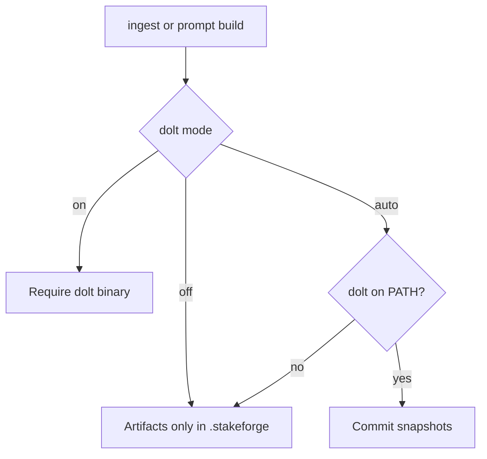
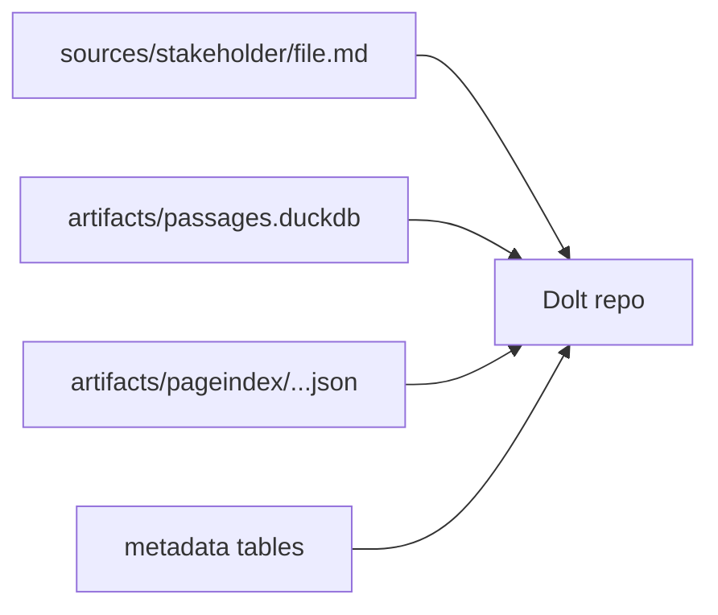
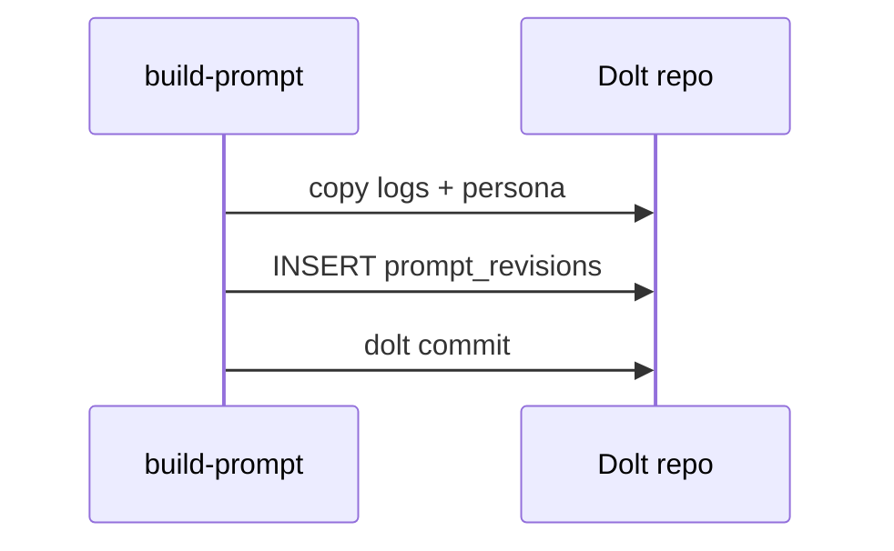
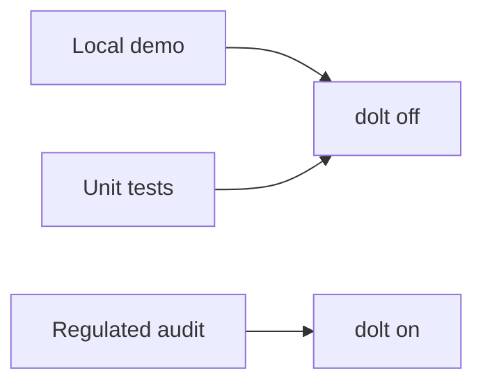

# 07 — Dolt and reproducibility

Dolt is **optional**. When it works, it gives you a **SQL database you can diff, branch, and time-travel**—useful for “what did this persona know on date X?” narratives.

## Decision tree



## What gets committed on ingest

Simplified view:



Tables include **sources**, **pageindex_artifacts**, **rebuilds** (see `store.py`).

## Prompt revision logging

When Dolt is on and the repo exists, `build_persona_prompt` may copy:

- Evidence JSON logs
- Persona file snapshot

…and insert a row into **`prompt_revisions`**, then commit.



Failures are intentionally **non-fatal** (network-free CLI still works).

## Practical workflows

### Compare two ingest states

Use Dolt’s native tooling:

```bash
cd .stakeforge/dolt
dolt log --oneline
dolt diff <commit1> <commit2>
```

### Time-travel queries

Dolt supports `AS OF` semantics for SQL reads (consult [Dolt docs](https://docs.dolthub.com/)). StakeForge does not wrap every query yet; the committed **files** remain the portable audit trail.

## When to skip Dolt



## Next document

[08 — Examples catalog](08-examples-catalog.md)
