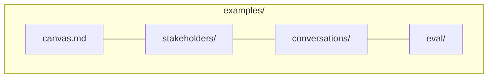
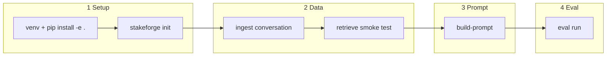

# 08 — Examples catalog

Sample content lives under **`examples/`** at the repository root. Paths below are relative to that folder.

## Directory map

## File reference

| Path | Role |
|------|------|
| `canvas.md` | Lightweight stakeholder canvas placeholders |
| `stakeholders/maria_chen.md` | Default **persona** for docs and `task verify:e2e` |
| `stakeholders/cfo_jordan_lee.md` | Persona with full **`stakeforge_persona`** rubric (CFO pushback demo) |
| `conversations/2026-03-kickoff-maria.md` | **Corpus** with headings for `ingest` |
| `eval/sample_cases.jsonl` | Minimal deterministic eval suite (expects average ≈ **1.0** in `task verify`) |
| `eval/cases.full.jsonl` | Two-case Maria suite (threshold **≥ 0.85** in verify) |
| `eval/cases.pushback.jsonl` | CFO case with `must_push_back` |
| `eval/interview_with_eval_frontmatter.md` | Template for `eval extract` (Maria) |
| `eval/interview_cfo_notes_with_eval.md` | Interview notes + eval YAML (CFO) |
| `eval/replies/*.txt` | Model replies; filename stem must match `case_id` |

## Suggested exercises

| Goal | Commands / files |
|------|-------------------|
| Golden CLI path | Follow [04 — Workflow](04-workflow-ingest-to-prompt.md) with Maria paths |
| Rubric-heavy persona | Use `stakeholders/cfo_jordan_lee.md` in `build-prompt --persona-md` |
| Pushback eval | `stakeforge eval run` with `eval/cases.pushback.jsonl` and `eval/replies/cfo-budget-pushback-1.txt` |
| Container verify | `task verify` ([09 — Podman + Taskfile](09-podman-taskfile.md)) |

Command snippets also appear in `examples/README.md`.

## Next step

Return to [Documentation home](README.md).
