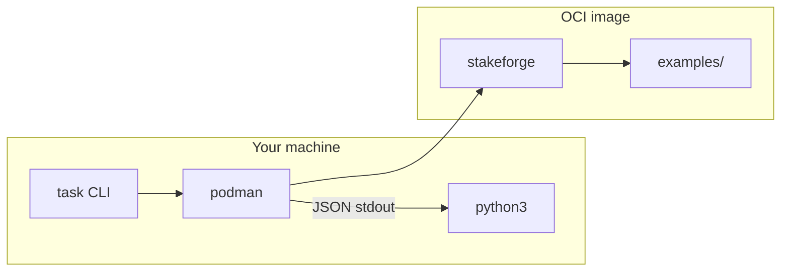
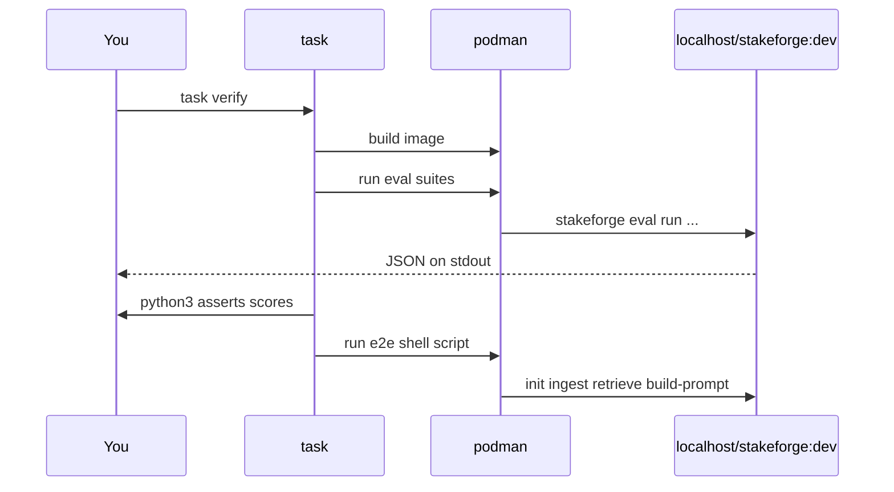
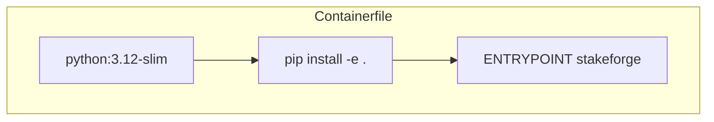

# 09 — Podman + Taskfile verification

This repository ships a [Taskfile](https://taskfile.dev/) and a **Podman** [Containerfile](../Containerfile) so you can run the same **quick verification** steps in an isolated Linux environment—no local Python venv required (except host `python3` for piping JSON from `podman run` on two eval tasks).

## Prerequisites

- [Podman](https://podman.io/) (or a Docker-compatible CLI if you change `vars.PODMAN`—not tested here).
- [Task](https://taskfile.dev/installation/) (`go-task` / `task` binary).
- Host **Python 3** for `task verify:eval-*` assertions (parses JSON printed by the container).



## One-shot verification

From the repository root:

```bash
task verify
```

This is the same path CI-style checks use: **build image → eval JSONL suites → end-to-end CLI → eval extract**. No Dolt binary is required in the image (`STAKEFORGE_DOLT=off`).



### What `task verify` runs

| Step | Task | Meaning |
|------|------|---------|
| Build | `build` | `podman build -t localhost/stakeforge:dev -f Containerfile .` |
| Eval sample | `verify:eval-sample` | `sample_cases.jsonl` average score ≥ **0.999** |
| Eval full | `verify:eval-full` | `cases.full.jsonl` average score ≥ **0.85** |
| E2E CLI | `verify:e2e` | `init` → `ingest` → `retrieve` → `build-prompt` inside the container |
| Extract | `verify:eval-extract` | `eval extract` from interview front matter → one JSONL line |

## Individual tasks

```bash
task build                 # image only
task verify:eval-sample
task verify:eval-full
task verify:e2e
task verify:eval-extract
task shell                 # interactive bash in the image
```

Override the container engine:

```bash
task verify PODMAN=podman-remote
```

Override the image name:

```bash
task build IMAGE=localhost/my-stakeforge:dev
```

## Image details

- **Base:** `python:3.12-slim`
- **Dolt:** disabled by default (`STAKEFORGE_DOLT=off` in the image env) so containers never require the `dolt` binary.
- **Entrypoint:** `stakeforge` — `podman run … localhost/stakeforge:dev eval run …` is valid.



## SELinux (Fedora / RHEL)

If you later mount the working tree into the container for live development, add `:Z` to volume flags. The current `verify` tasks **do not** mount the repo; everything is **baked into the image** at build time.

## See also

- [03 — Installation](03-installation.md)
- [Examples README](../examples/README.md)
- [Taskfile.yml](../Taskfile.yml)
