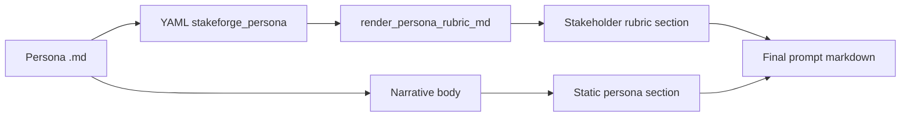
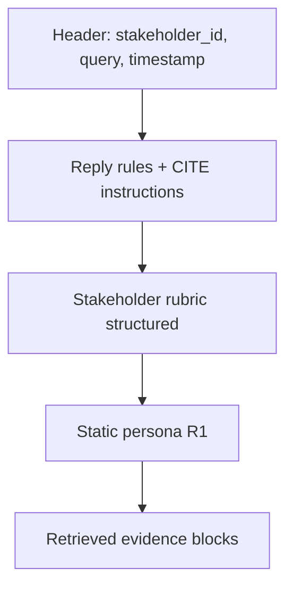

# 10 — Structured persona rubric (`stakeforge_persona`)

Persona Markdown can carry **two layers**:

| Layer | Where it lives | Purpose |
|--------|----------------|--------|
| **Narrative persona** | Body of the `.md` after front matter | Rich prose: role, motivations, voice samples |
| **Structured rubric** | YAML key `stakeforge_persona:` | Temperament, incentives, friction, pushback rules—easy to render into prompts and to judge in eval |

The CLI merges both when you run `build-prompt`. If there is no rubric block, the prompt still works; the structured section shows a short placeholder.

## Data flow



## Prompt section order (actual)

`build-persona_prompt` renders sections in this order:



This puts **behavioral constraints** (rubric) immediately before the long persona prose, so models see incentives and pushback rules early.

## YAML schema (summary)

All fields are optional except **`id`** (required string). Nested objects default to empty lists.

| Block | Fields | Meaning |
|--------|--------|--------|
| Root | `id`, `persona`, `metadata` | Stable id, one-line label, free-form meta |
| `temperament` | `tone[]`, `default_stance` | Voice and default posture |
| `incentives` | `say_yes_when[]` | Conditions that earn a “yes” |
| `friction_points` | `triggers[]` | What annoys / escalates skepticism |
| `pushback_rules[]` | `when`, `must_push_back`, `ask_for[]` | Structured pushback triggers |
| `consistency_metrics` | `must_do[]`, `must_not_do[]` | Checklist for staying in character |

Implementation: Pydantic models in `src/stakeforge/persona_schema.py` (`StakeforgePersona` and nested types), loaded by `src/stakeforge/persona_load.py`.

## Minimal example

```yaml
---
stakeforge_persona:
  id: example_pm
  persona: "Feature-hungry product owner"
  temperament:
    tone: ["direct", "outcome-focused"]
    default_stance: "supportive"
  incentives:
    say_yes_when:
      - "scope is fixed with clear acceptance criteria"
  friction_points:
    triggers:
      - "dates moved without a tradeoff discussion"
  pushback_rules:
    - when: vague_scope_change
      must_push_back: true
      ask_for:
        - "what we descope"
        - "who decides"
  consistency_metrics:
    must_do: ["ask for acceptance criteria"]
    must_not_do: ["promise dates without team input"]
---

# Stakeholder: …
```

A full worked example lives at `examples/stakeholders/cfo_jordan_lee.md`.

## Connection to evaluation

| Mechanism | What it uses |
|-----------|----------------|
| **LLM rubric** (`--llm-rubric`) | Loads the same `stakeforge_persona` from `persona_md` (via `--persona-base`) and passes it to the judge prompt |
| **Deterministic pushback** | If `EvalCase.expected.must_push_back` is true, a small heuristic (`_pushback_heuristic`) contributes **weight 0.20** to the normalized deterministic score |
| **JSONL / extract** | Interview front matter can set `must_push_back` / `pushback_on` under `stakeforge_eval` |

See [06 — Evaluation and rubric](06-evaluation-and-rubric.md) and `examples/eval/cases.pushback.jsonl`.

## Next document

[Documentation home](README.md)
