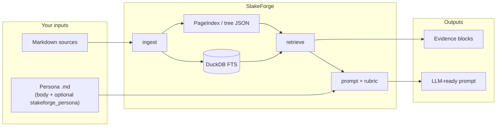

# StakeForge documentation

Welcome. These guides explain what StakeForge is, how the pieces fit together, and how to run realistic examples end to end.

## Start here

| Guide | What you learn |
|--------|----------------|
| [00 — Visual summary](00-visual-summary.md) | All key diagrams on one page |
| [01 — Overview](01-overview.md) | Goals, who it is for, Release 2 scope |
| [02 — Architecture](02-architecture.md) | Components, data flow, many diagrams |
| [03 — Installation](03-installation.md) | Python env, optional Dolt & PageIndex |
| [04 — Workflow: ingest → prompt](04-workflow-ingest-to-prompt.md) | Day-to-day CLI walkthrough |
| [05 — Hybrid retrieval](05-hybrid-retrieval.md) | DuckDB FTS + PageIndex merge policy |
| [06 — Evaluation & rubric](06-evaluation-and-rubric.md) | JSONL cases, scoring, LLM rubric, GEPA hook |
| [07 — Dolt & reproducibility](07-dolt-and-reproducibility.md) | When commits happen, what is versioned |
| [08 — Examples catalog](08-examples-catalog.md) | What lives under `examples/` |
| [09 — Podman + Taskfile](09-podman-taskfile.md) | Containerized quick verification |
| [10 — Structured persona rubric](10-structured-persona-rubric.md) | `stakeforge_persona` YAML → prompt + eval |

## Quick orientation

For runnable files, see the [examples README](../examples/README.md).
