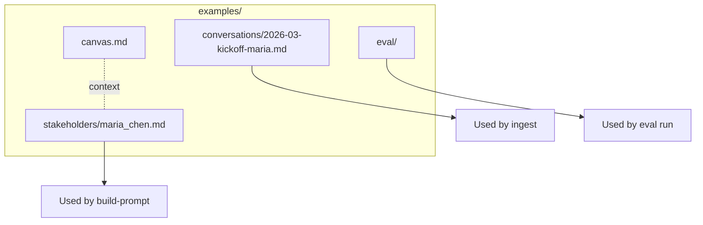
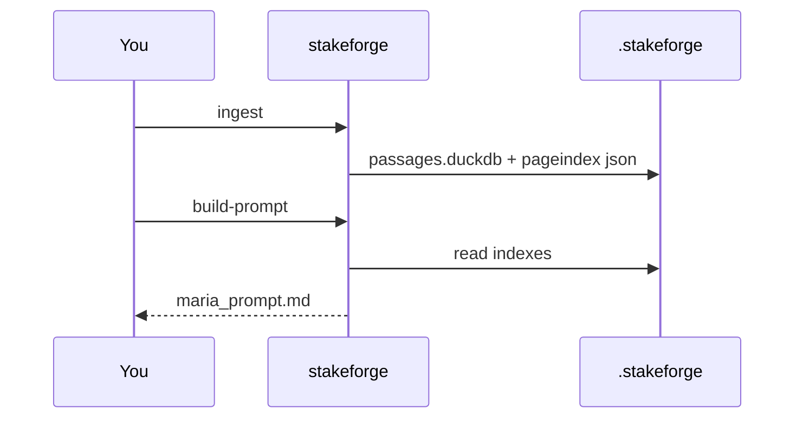

# Examples

This folder contains **copy-paste-ready** Markdown and eval fixtures that mirror a real stakeholder workflow (**Maria Chen**, VP Operations at a fictional logistics company).

## What is included



| Path | Use |
|------|-----|
| `canvas.md` | Lightweight program / stakeholder context |
| `stakeholders/maria_chen.md` | Persona for `--persona-md` |
| `conversations/2026-03-kickoff-maria.md` | Corpus with `##` headings for passages + PageIndex |
| `eval/` | JSONL cases, replies, front matter template |

## Golden path (commands)

From the **repository root** (adjust `--root` if you keep `.stakeforge` elsewhere):

```bash
python -m venv .venv && source .venv/bin/activate
pip install -e .

stakeforge init
stakeforge ingest --stakeholder-id maria_chen \
  --md-path examples/conversations/2026-03-kickoff-maria.md \
  --source-uri 2026-03-kickoff-maria.md

stakeforge retrieve --stakeholder-id maria_chen \
  --query "ROI board checkpoint phased" --format md

stakeforge build-prompt \
  --stakeholder-id maria_chen \
  --persona-md examples/stakeholders/maria_chen.md \
  --query "Can we promise ROI in six months for the board?" \
  --out /tmp/maria_prompt.md
```



## Evaluation examples

See [`eval/README.md`](eval/README.md) for:

- `sample_cases.jsonl` — single-case suite
- `cases.full.jsonl` — two-case suite + matching replies
- `interview_with_eval_frontmatter.md` — `eval extract` demo

## Learn more

Full diagrams and theory live in the [`docs/`](../docs/README.md) directory.

## Same checks in Podman (`task verify`)

From the repo root (install [Task](https://taskfile.dev/installation/) + [Podman](https://podman.io/)):

```bash
task verify
```

See [docs/09-podman-taskfile.md](../docs/09-podman-taskfile.md).
