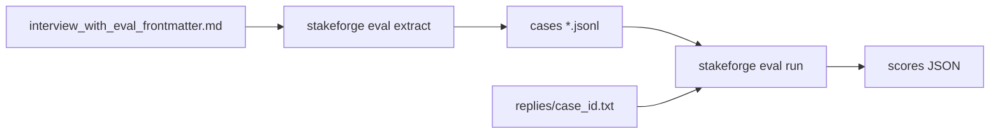
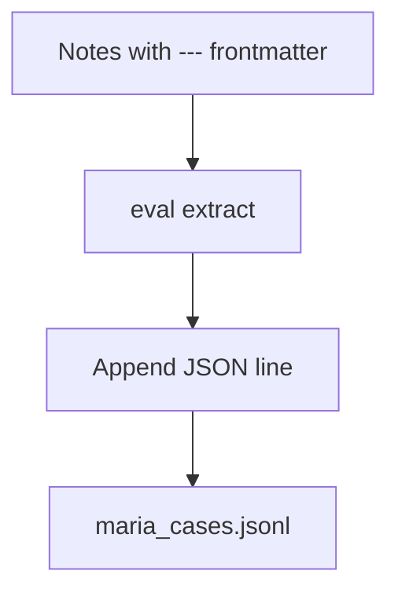

# Evaluation examples

## File roles



| File | Description |
|------|-------------|
| `sample_cases.jsonl` | One `EvalCase` (Maria / ROI framing) |
| `cases.full.jsonl` | Two cases; `replies/` has **both** `case_id` files |
| `cases.pushback.jsonl` | One case that tests **budget increase pushback** (CFO) |
| `replies/demo-roi-1.txt` | Model reply for `demo-roi-1` |
| `replies/maria-interview-roi.txt` | Model reply for `maria-interview-roi` |
| `replies/cfo-budget-pushback-1.txt` | Model reply for `cfo-budget-pushback-1` |
| `interview_with_eval_frontmatter.md` | YAML metadata + gold evidence |
| `interview_cfo_notes_with_eval.md` | YAML metadata for the CFO pushback case |

## Run the suites

```bash
# From repo root, after pip install -e .
stakeforge eval run \
  --dataset examples/eval/sample_cases.jsonl \
  --replies-dir examples/eval/replies \
  --persona-base .

stakeforge eval run \
  --dataset examples/eval/cases.full.jsonl \
  --replies-dir examples/eval/replies \
  --persona-base .

stakeforge eval run \
  --dataset examples/eval/cases.pushback.jsonl \
  --replies-dir examples/eval/replies \
  --persona-base .
```

## Build JSONL from interview notes

```bash
stakeforge eval extract \
  --notes examples/eval/interview_with_eval_frontmatter.md \
  --out /tmp/maria_cases.jsonl
```



### Front matter tips

- Put evaluation metadata under `stakeforge_eval:` (nested) **or** at the top level of the YAML document—both work.
- `gold_evidence` becomes the `evidence[]` list inside `EvalCase`.
- You can set explicit `evidence_id` values so replies stay stable:

```yaml
gold_evidence:
  - evidence_id: gold:maria-board-2
    source_uri: examples/conversations/2026-03-kickoff-maria.md
    heading_path: What she asked from the team
    text: |
      ...
```

## Optional LLM rubric

```bash
export OPENAI_API_KEY=...
stakeforge eval run \
  --dataset examples/eval/cases.full.jsonl \
  --replies-dir examples/eval/replies \
  --persona-base . \
  --llm-rubric
```

See [docs/06-evaluation-and-rubric.md](../../docs/06-evaluation-and-rubric.md).
